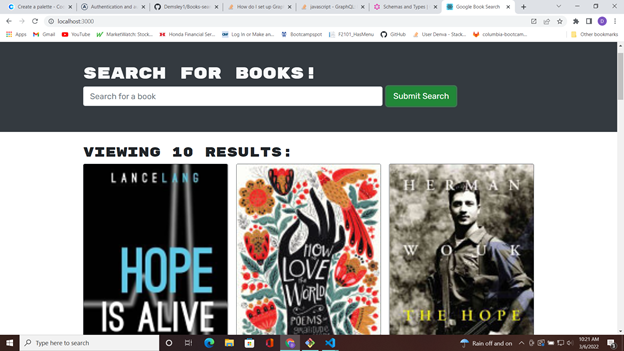
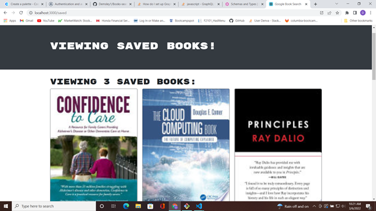
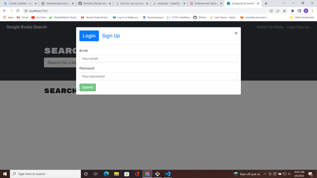

# Books-search-engine 
  ## Description 

  Using a provided book search application, with restful api standards, I have refactored the code to use the popular graphql model instead.  The functioning applicaiton uses the google search api to look for any book inputed then allows the user to save the book to their account if logged in. Along with the graphql, and appollo client, I implemented the complimentary appollo server that allows the graphql to work on the backend. This project displays the benefits of learning multiple programs and libraries and how to use them to store, and retrieve data to serve front end functionality, by the seamless transition which required minimal change to fron end code and logic. 

  ## Table of Contents
  In here you will find links to each section of this projects readme
  - [Installation](#installation)
  - [Usage](#usage)
  - [Screenshots/Links](#screenshots/links)
  - [License](#license)
  - [Questions](#questions)

  ## *Installation*

  This app is hosted live on heroku for anyone to use the production version of it. The development version and code is provided in the projects repo on GitHub. Feel free to download and test the app's code or view the code structure as an example of how to implement a graphql model, and appollo client/server in a existing restful application.

  ## Screenshots/links

  - 
  - 
  - 

  - Live website link: [Book-Search-Engine]()

  ## Usage 

  Visit the production ready site on heroku, Link is down below.
 
  ## *License*

  Copyright 2021 &copy; Denva Emsley

      Permission is hereby granted, free of charge, to any person obtaining a 
      copy of this software and associated documentation files (the "Software"), 
      to deal in the Software without restriction, including without limitation 
      the rights to use, copy, modify, merge, publish, distribute, sublicense, 
      and/or sell copies of the Software, and to permit persons to whom the Software 
      is furnished to do so, subject to the following conditions:
          
      The above copyright notice and this permission notice shall be included in all copies or substantial portions of the Software.
          
      THE SOFTWARE IS PROVIDED "AS IS", WITHOUT WARRANTY OF ANY KIND, EXPRESS OR IMPLIED, INCLUDING BUT NOT LIMITED TO THE WARRANTIES OF MERCHANTABILITY, FITNESS FOR A PARTICULAR 
      PURPOSE AND NONINFRINGEMENT. IN NO EVENT SHALL THE AUTHORS OR COPYRIGHT HOLDERS BE LIABLE FOR ANY CLAIM, DAMAGES OR OTHER LIABILITY, WHETHER IN AN ACTION OF CONTRACT, TORT OR OTHERWISE, 
      ARISING FROM, OUT OF OR IN CONNECTION WITH THE SOFTWARE OR THE USE OR OTHER DEALINGS IN THE SOFTWARE.
      

  ## Tests

  test it using the react model included jest testing platforms.

  ## Questions 

  - My GitHub username: Demsley1
  - Link to my GitHub page and repositories: [Github Link](https://github.com/Demsley1)
  _Link to my main work email if anyone should ever choose to contact me regarding work, or with helpful suggestions on how to improve this project and 
  also fix or update any major issues with project_
  - For All inquires email me at: emsley3684@gmail.com
